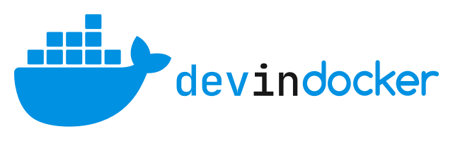
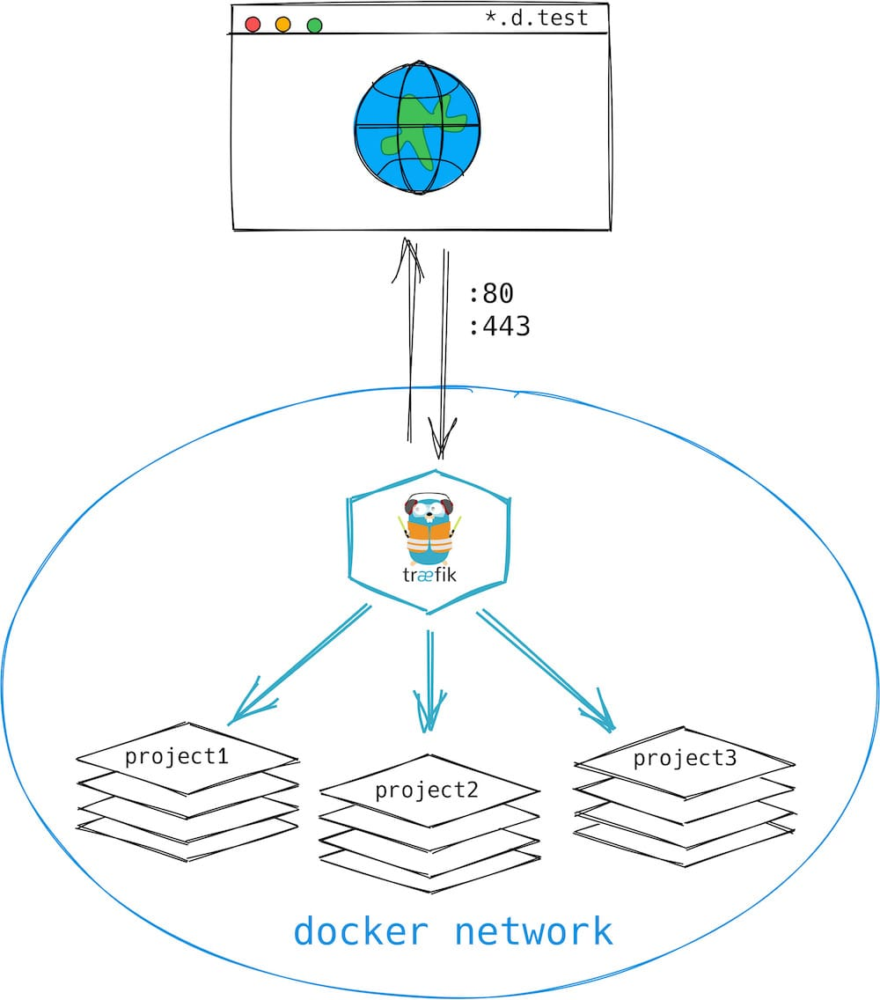

<div align="center">
  
</div>
<br>
This project provides a basic Docker setup, for building a local development environment with HTTPS support.

## What does it do?
Devindocker run a container with a reverse proxy and load balancer called [Træfik](https://github.com/traefik/traefik). This will be the only container to expose a port to our docker host. The containers of the different projects and the træfik container will be in the same docker network. Træfik will forward the requests from the client to the corresponding container.
<br>
<br>
<div align="center">
	
</div>

##  Requirements
* docker
* docker-compose
* [mkcert](https://github.com/FiloSottile/mkcert) for SSL certificate
* no other services listening port 80 and 443

## Features
* [Træfik](https://traefik.io) HTTP reverse proxy and load balancer made to deploy microservices with ease.
* [Portainer](https://portainer.io/) Simple management UI for Docker.
* [MailHog](https://github.com/mailhog/MailHog) Web and API based SMTP testing.

## Installation
### Generate certificates using mkcert
```bash
# If it's the firt install of mkcert, run
mkcert -install

# Generate certificate for domain "d.test" and their sub-domains
mkcert -cert-file certs/d.test-cert.pem -key-file certs/d.test-key.pem "d.test" "*.d.test"
```

### Create .env file
Copy the default `.env` file als startpoint:

```bash
cp .env_default .env
```
And change something if you need to.

### Create træfik config files
Copy the default ones als startpoint:

```bash
cp traefik/config_default.yml traefik/config.yml
cp traefik/traefik_default.yml traefik/traefik.yml
```
And change something if you need to.

### Hosts File - Wildcard DNS domain on Mac OS X (optional)
Using [Dnsmasq](http://www.thekelleys.org.uk/dnsmasq/doc.html) as a local resolver.

Install Dnsmasq with brew

```bash
brew install dnsmasq
```

Create config directory

```bash
mkdir -pv $(brew --prefix)/etc/
```

Setup *.test

```bash
echo 'address=/.test/127.0.0.1' >> $(brew --prefix)/etc/dnsmasq.conf
```

Autostart - now and after reboot

```bash
sudo brew services start dnsmasq
```

Add to resolvers.
Create resolver directory

```bash
sudo mkdir -v /etc/resolver
```

Add your nameserver to resolvers

```bash
sudo bash -c 'echo "nameserver 127.0.0.1" > /etc/resolver/test'
```

Now you can use any .test domain and it will always resolve to `127.0.0.1`.<br/>
You can easily create new domains on the fly, and never have to worry about your `/etc/hosts` file again.

**Source:** [Setting up a wildcard DNS domain on Mac OS X](http://asciithoughts.com/posts/2014/02/23/setting-up-a-wildcard-dns-domain-on-mac-os-x/) - [ASCII Thoughts](http://asciithoughts.com)

## Run
Start the containers normally:

```bash
docker-compose up -d
```

## Accessing services
* [Træfik (https://traefik.d.test)](https://traefik.d.test)
* [Portainer (https://portainer.d.test)](https://portainer.d.test)
* [MailHog (https://mailhog.d.test)](https://mailhog.d.test)

## Setting a new Project
To create another project you need to add træfik labels inside the container that need to be access from the outside and add dev-in-docker network.

```bash
labels:
  - "traefik.enable=true"
  - "traefik.http.routers.${CONTAINER_NAME}.entrypoints=https"
  - "traefik.http.routers.${CONTAINER_NAME}.rule=Host(`${APP_URL}`)"
  - "traefik.http.routers.${CONTAINER_NAME}.tls=true"
  - "traefik.docker.network=dev-in-docker-network"
  - "traefik.http.services.${CONTAINER_NAME}.loadbalancer.server.port=80"
```

```bash
networks:
  default:
    internal: true
  # Network from dev-in-docker
  dev-in-docker-network:
    name: "dev-in-docker-network"
    external: true
```

[Check some more examples](examples)

## Setting non docker Project
For all the projects running locally out of docker you can add a route inside `traefik/config.yml`:

```bash
http:
  routers:
    non_docker_service:
      rule: "Host(`non_docker_service.d.test`)"
      service: "non_docker_service"
      tls: {}

  services:
    non_docker_service:
      loadBalancer:
        servers:
          - url: http://host.docker.internal:3000
```

Now you can call your local running project like this: `non_docker_service.d.test`

## References
* [Stonehenge](https://github.com/druidfi/stonehenge)
* [Traefik v2 HTTPS (SSL) on localhost](https://github.com/Heziode/traefik-v2-https-ssl-localhost)
* [Development enviroment with Docker and Traefik](https://dev.to/flemssound/development-enviroment-with-docker-and-traefik-1lg6)
* [Docker localhost](https://github.com/elalemanyo/docker-localhost)
